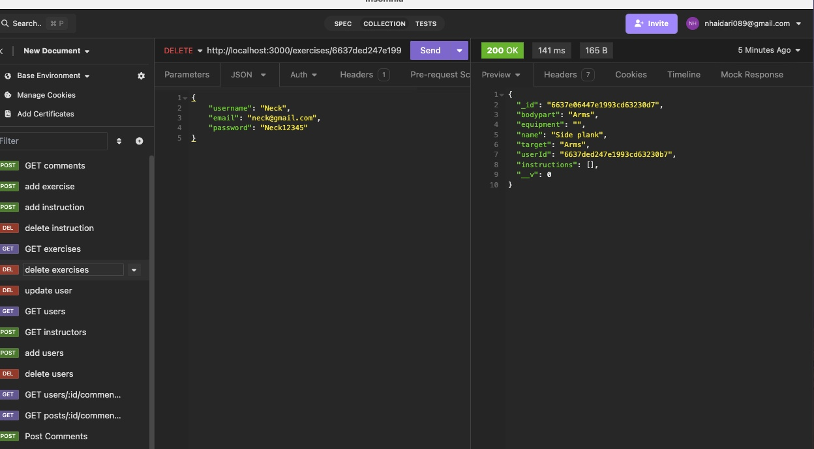
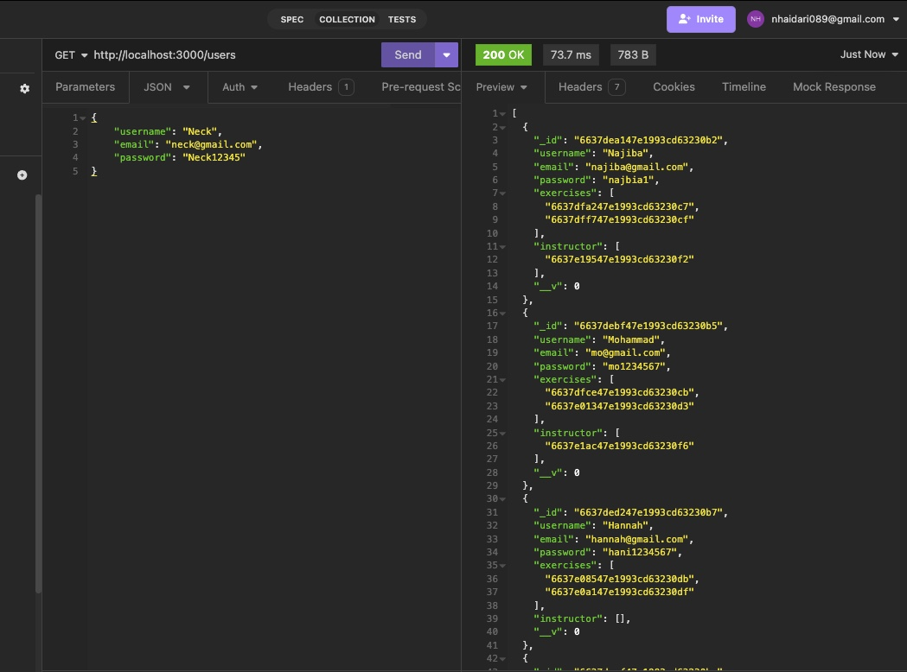

# Mongodb-database-application
## SBA-319 mongodb-database-application

## Objectives of this SBA
- Create a server application with Node, Express, and MongoDB.
- Create a CRUD API using Express and MongoDB.
- Create MongoDB indexes.
- Use MongoDB indexing to make efficient queries.
- Create MongoDB validation rules.
- Use MongoDB validation to ensure data consistency.

## Screenshot

  
  
  

## Table of Contents

- [Routes](#routes)
- [Technologies Used](#technologies-used)
- [Github Link](#github-link)
- [Installation](#installation)
- [License](#license)

## Routes
The application routes, please note that only GET /users and /users/:userId have been used for front-end view by EJS template engine: 

* GET /
    * GET /users
    * POST /users/addUser
        * GET /users/:userId
        * PUT /users/updateUser/:userId
        * DELETE /users/deleteUser/:userId
    * GET /exercises
    * POST /exercises
        * GET /exercises/:exerciseId
        * DELETE /exercises/:exerciseId
        * POST exercises/:exerciseId/instructions (add instructions to a specific exercise)
        * DELETE /exercises/:exerciseId/instructions/:instructionId ( delete a specific instruction from an exercise)

## Technologies Used
- Mongoose / Mongodb
- Javascript 
- Express.js
- RESTful API
- Node.js
- EJS Template Engine
- Bootstrap

## Github Link

- Github Repo URL: https://github.com/Najiba-Haidari/mongodb-database

## Installation
- Fork the respository
- npm install
- node server.js
- Navigate to localhost:3000 and/or Insomnia/Postman

## License

This project is under the 

